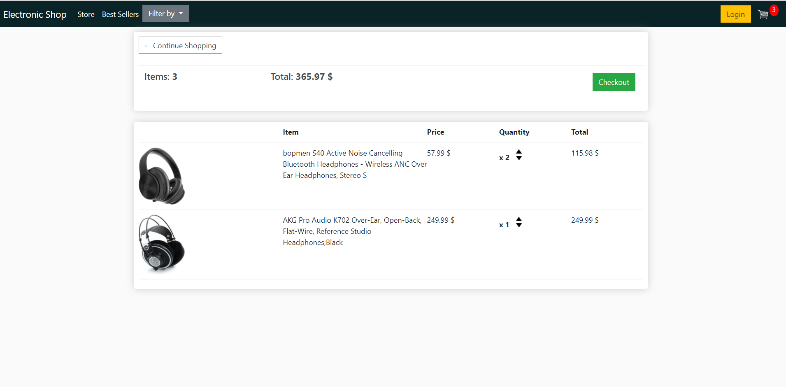

# Electronic web shop

Ecommerce website build in Django where user can log in and buy ittems.
User can add an item many times, and comes back the added items will still be in the basket

Data structure.
We have Customer, Product, Order, OrderItem and Shipping address models that will be inserted in SQLite database of the project.

<h3> On going steps </h3>
[X]  Design using boostrap  
[X]  Models and database migrations  
[X]  Generating product list dynamic from database  
[X]  Creating a User/Customer by login signup  
[X]  Adding Order in the database of the User   
[X]  Adding multipule Order in the User database  
[X]  Check out properties, payment validation  
[X]  Shipping Address  
[ ]  Categories list, and products sort based on category  

Categories list, and each product is appeared based on the category it belongs.

So far --> 

Store demo:

Order Cart checkout:

Shipping :
